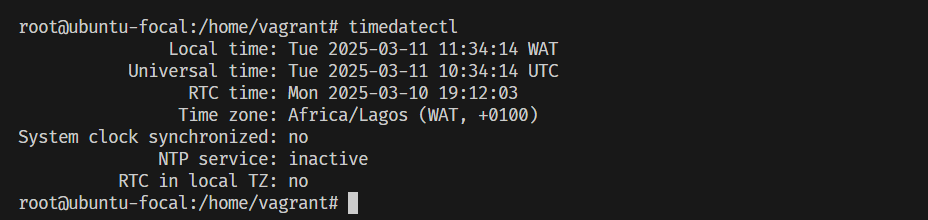

# To Set the time-zone on linux machine.

1. timedatectl - shows current timezone
2. timedatectl list-timezones - shows a list of available timezones.
3. timedatectl set-timezone Region/City - set the timezone to the region and city you want. (timedatectl set-timezone Africa/Lagos.)

