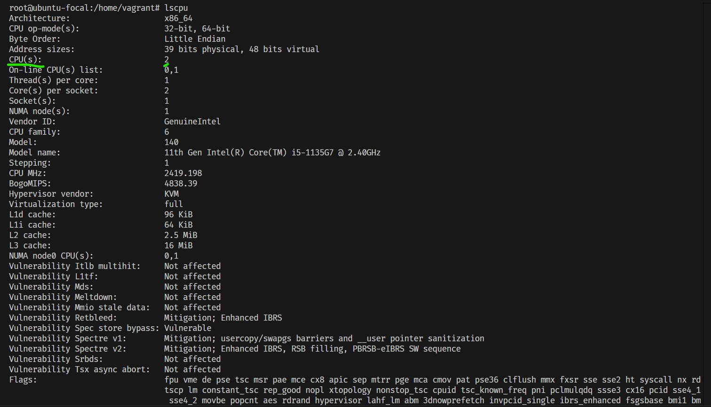
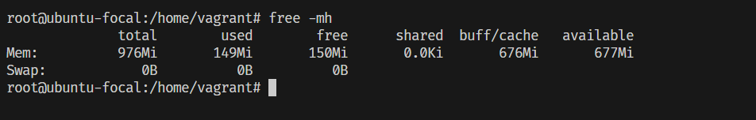
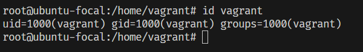
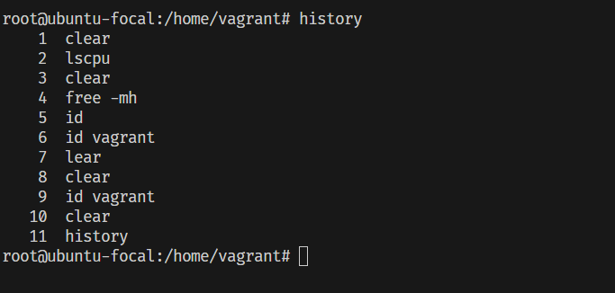
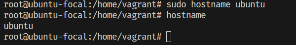
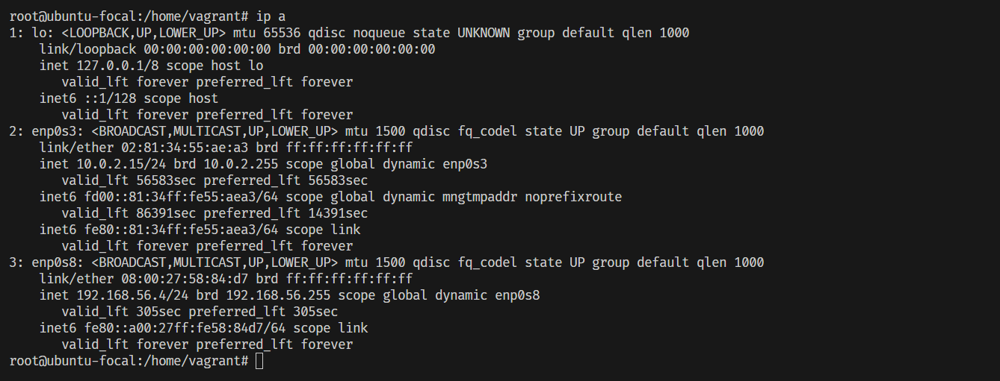
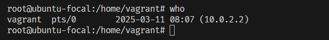
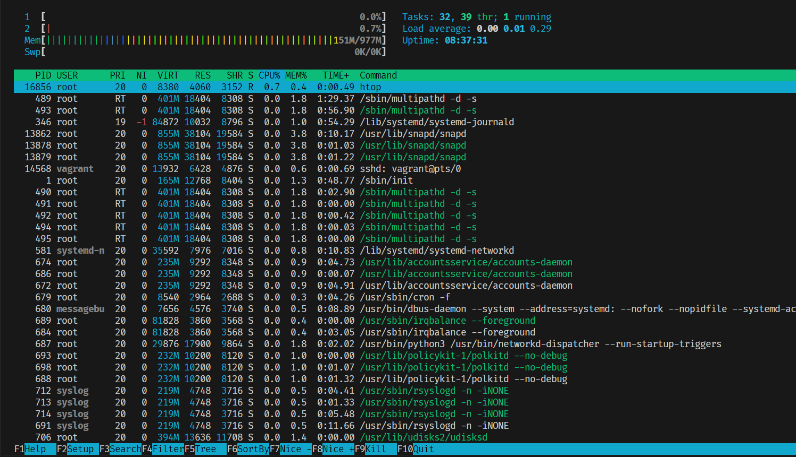
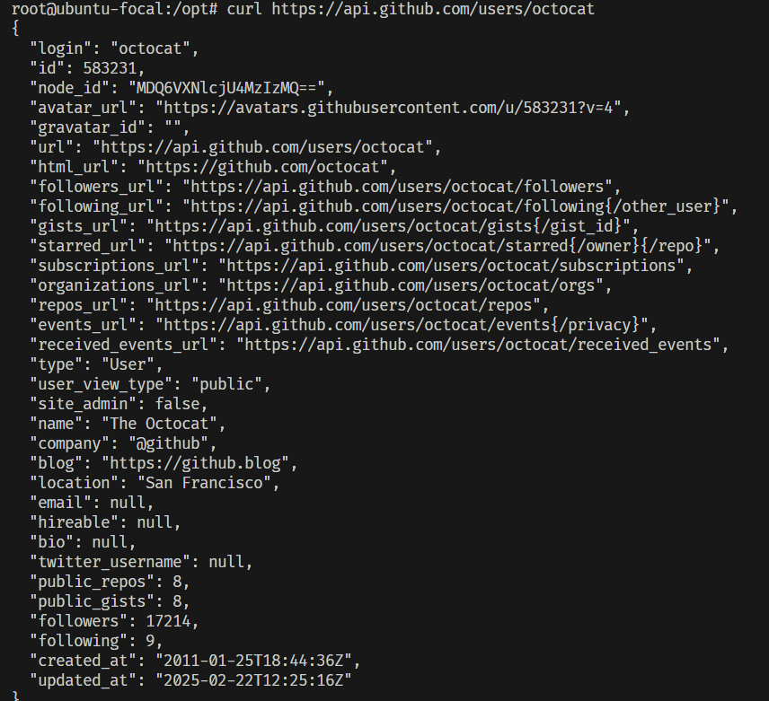
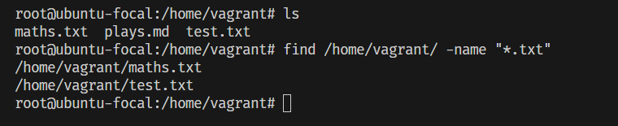

# Linux Commands

## 1. lscpu - Display CPU information
The `lscpu` command provides a detailed information about your CPU architecture, cores, threads, and more.

# Usage
lscpu




## 2. free - Check memory Usage
The `free` command displays available and used system memory (RAM and swap).

# Usage
free -mh : This shows the memory usage in m(megabytes) and h(human-readable format)




## 3. id - Show User and Group IDs
The `id` command displays the user ID (UID) and group ID (GID) of the current or specified user.

# Usage
id: shows the ID of the current user
id <username>: shows the ID of the specified user




## 4. history - Show Command History
The `history` command displays previously executed commands.

# Usage
history




## 5. hostname -  Display or Set the System Hostname
The `hostname` command prints or sets the system's hostname.

# Usage
hostname: Displays the current hostname
sudo hostname <new-hostname>: Changes the hostname to whatever is in the bracket.





## 6. ip - Show Network Configuration
The `ip` command displays and configures network interfaces.

# Usage
ip a: shows all network interfaces.




## 7. who - Show Logged-in Users
The `who` command displays users currently logged into the system.

# Usage
who




## 8. htop - Interactive Process Viewer
The `htop`command is an improved, interactive version of top that provides a real-time, color-coded view of system processes, CPU usage, memory usage, and more.

# Usage 
htop




## 9. curl - Transfer Data from URLs
The `curl` command allows you to download content from the internet, make API requests, and transfer data.

# Usage
# Download a file from a URL
curl -O https://example.com/file.zip

# Fetch website content
curl https://example.com

# Make a GET request to an API
curl https://api.github.com/users/octocat





## 10. Find - Search for Files and Directories in Linux
The `find` command in Linux is used to search for files and directories based on name, type, size, modification date, permissions, and more.

# Usage
find [starting_directory] [options] [expression]

E.g Find file by name
```bash
find /home/abdurrahman -name "*.txt"
```




